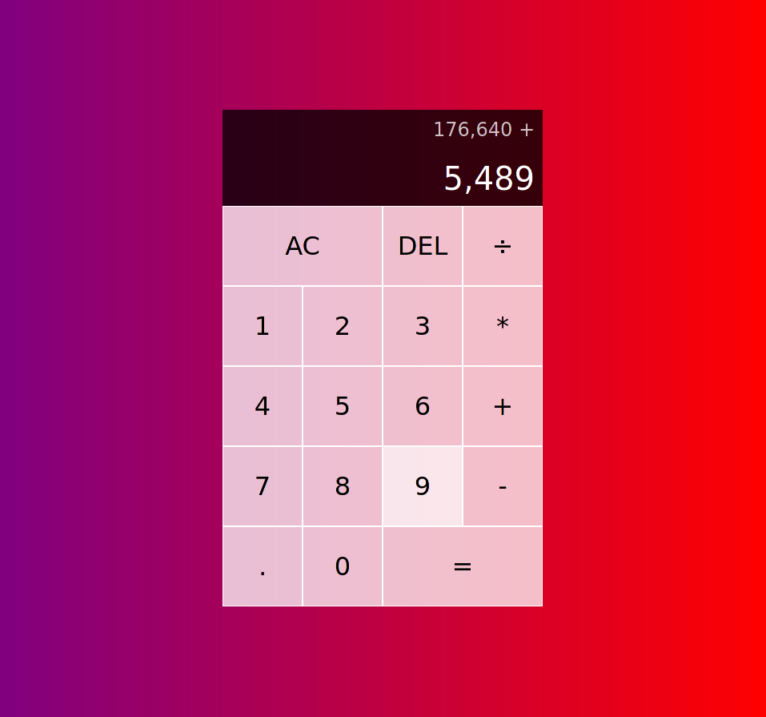
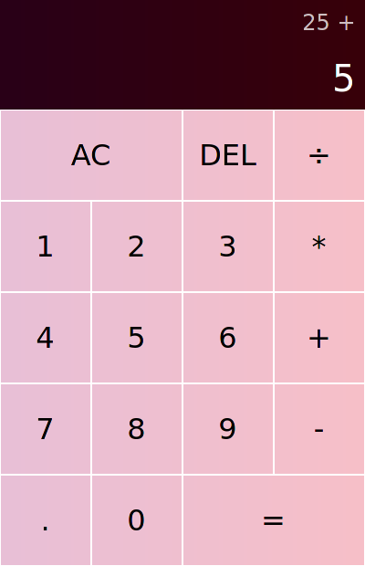
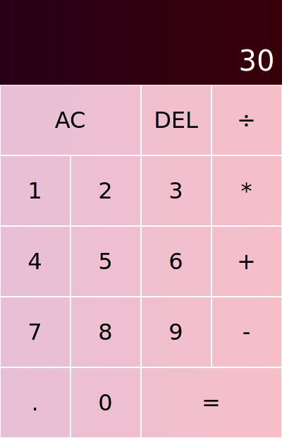

# Javascript Calculator
> Vanilla js calculator.

## Table of contents
* [Screenshots](#screenshots)
* [Technologies](#technologies)
* [Setup](#setup)
* [Status](#status)
* [Inspiration](#inspiration)
* [Contact](#contact)

## Screenshots

 

## Technologies
* Javascript
* CSS
* HTML

## Setup
Requirements
1. Web browser
2. Some math problems

Enjoy!
1. Clone the repository
2. launch index.html

## Status
Project is: _complete_

## Inspiration
My first javascript project.

## Contact
Created by [@hajisml](https://twitter.com/hajisml) - on Twitter.

